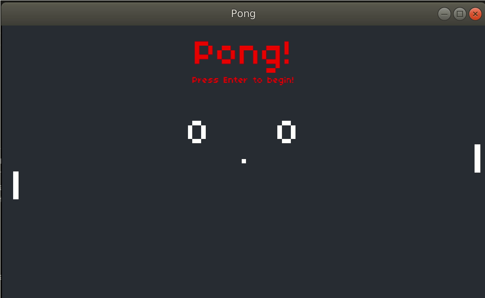

## Pong

A rewrite of the classic Pong game using LÖVE and Lua.
The ball gets faster as the game progresses to keep the game exciting.

Move player one's paddle using the `W / S` keys and player two's with  `Up / Down`. 

## How to run

Make sure you have [LÖVE](https://love2d.org/wiki/Getting_Started) installed. Clone this repo and run `love .` in the main directory.

## Resources

* Check out the [CS50's Introduction to Game Development
](https://www.youtube.com/playlist?list=PLWKjhJtqVAbluXJKKbCIb4xd7fcRkpzoz) to learn how to make this and other games.
* Learn X in Y minutes [where X=lua](https://learnxinyminutes.com/docs/lua/).
